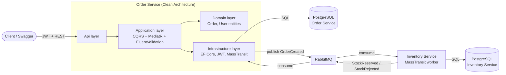

# OrderFlow 🍎

[](https://github.com/Walidso/OrderFlow/actions/workflows/ci.yml)

A small but complete **event-driven microservices system** built with .NET 8 — created as a hands-on portfolio project to demonstrate Clean Architecture, CQRS, async messaging, testing, and containerization.

**The flow in one sentence:** a user registers, logs in, and places an order via a REST API; the order is saved as `Pending` and an event is published; a separate Inventory service consumes it, reserves stock, and answers with an event that flips the order to `Confirmed` or `Rejected`.

## Architecture



## Run it (3 commands)

```bash
git clone <this-repo> && cd OrderFlow
docker compose up --build
# then open:
open http://localhost:5001/swagger
```

That's it — migrations apply automatically on startup.

**Web UI:** http://localhost:5003 — register/login, place orders with one-click presets (happy path, insufficient stock, poison message, mangled token), watch order status and live stock update in the browser. No curl or Swagger needed.

**Or try the full flow in Swagger:**
1. `POST /api/v1/auth/register` → copy the `token`
2. Click **Authorize**, paste the token
3. `POST /api/v1/orders` with `productId: "APPLE-1"`, quantity 3
4. `GET /api/v1/orders/{id}` → watch status go `Pending` → `Confirmed`
5. Peek at stock dropping: http://localhost:5002/stock
6. RabbitMQ UI: http://localhost:15672 (guest / guest)

**Break it on purpose (the fun part) — via the web UI presets or manually:**
- Order `MANGO-1` with quantity 5 → order becomes `Rejected` (only 3 in stock)
- Order `DURIAN-1` → the Inventory consumer throws, retries 3× (watch its logs), then the message lands in the `inventory-order-created_error` queue — RabbitMQ's equivalent of a dead-letter queue
- Send a request with a mangled token → `401` before any handler runs

## Run the tests

```bash
dotnet test
```

- **Order Service unit tests** (`tests/OrderService.UnitTests`) — handlers in isolation, EF InMemory + NSubstitute mocks, milliseconds each
- **Order Service integration tests** (`tests/OrderService.IntegrationTests`) — the real app booted in memory via `WebApplicationFactory`, real HTTP, real JWT validation, SQLite instead of Postgres, MassTransit test harness instead of RabbitMQ. No Docker needed.
- **Inventory Service unit tests** (`tests/InventoryService.UnitTests`) — `OrderCreatedConsumer` tested by mocking `ConsumeContext<T>` directly (it's just an interface — no bus needed), including the duplicate-delivery and thrown-exception idempotency cases; `EfStockStore`/`EfProcessedOrderStore` tested against SQLite (a real relational engine, no Docker) since their atomic-update logic doesn't translate against EF's InMemory provider.

## Tech decisions

| Decision | Why | Trade-off accepted |
|---|---|---|
| Clean Architecture (4 layers) | Business logic testable without HTTP/DB; dependencies point inward only | More projects/ceremony than a small CRUD app strictly needs |
| CQRS with MediatR | One handler = one use case = one focused unit test; validation as a pipeline behavior applies to every command automatically | Indirection: request flow is less obvious than a direct service call |
| RabbitMQ + MassTransit | Free, runs locally in Docker; MassTransit's abstractions (retry, error queues) map 1:1 to Azure Service Bus concepts | No broker-native dead-lettering — MassTransit emulates it with `_error` queues |
| PostgreSQL + EF Core migrations | Real relational DB, schema versioned in code, `Migrate()` on startup for zero-friction demo | Startup migration is wrong for multi-replica prod (race conditions) |
| JWT (symmetric HS256) | Stateless auth, easy to demo, standard claims flow | Single shared key; prod at scale would use asymmetric keys / an identity provider |
| PBKDF2 password hashing | Built into .NET, no dependency, salted + 100k iterations | Argon2/bcrypt are stronger choices if adding a package is acceptable |
| Global exception middleware → RFC 7807 | One error contract for all endpoints; no leaked stack traces | — |
| Inventory's own PostgreSQL | Database-per-service kept honest instead of an in-memory dictionary; stock and the idempotency guard both survive a restart; a conditional `UPDATE ... WHERE AvailableQuantity >= @qty` inside a transaction replaces an in-process lock, so reservation stays correct even with multiple replicas | A second Postgres container (`inventory-db`) — cheap locally, but two databases to operate instead of one |
| Hand-rolled Transactional Outbox | Save + publish become one atomic `SaveChangesAsync()`; a background poller relays events, closing the "order saved but event lost" gap | MassTransit ships an EF outbox that does this with less code — hand-rolled so the mechanics are visible and explainable, not hidden behind a NuGet feature flag |

## Project layout

```
src/
  BuildingBlocks/OrderFlow.Contracts/   # shared event records (the ONLY shared code)
  OrderService/
    OrderService.Domain/          # entities, zero dependencies
    OrderService.Application/     # CQRS handlers, validators, interfaces
    OrderService.Infrastructure/  # EF Core, migrations, JWT, MassTransit
    OrderService.Api/             # controllers, middleware, Program.cs
  InventoryService/
    InventoryService.Worker/      # MassTransit consumer, EF Core stock + idempotency, own Postgres
web/                              # static HTML/CSS/JS UI, served by nginx
tests/
  OrderService.UnitTests/
  OrderService.IntegrationTests/
  InventoryService.UnitTests/
```

## Transactional Outbox

`CreateOrderCommandHandler` used to save the order, then publish `OrderCreated` in a second, separate step — a crash between the two left a `Pending` order no one would ever process. That gap is closed now:

- The handler writes the order **and** an `OutboxMessage` row (the serialized event) through the **same** `SaveChangesAsync()` call — one transaction, so either both commit or neither does.
- A background poller (`OutboxDispatcherBackgroundService`, `Infrastructure/Outbox/`) reads unprocessed rows every couple of seconds, publishes them through the same `IEventPublisher` port, and marks them processed. A failed publish (broker down, etc.) just leaves the row for the next poll — up to a configurable `MaxRetries`, after which it's left in place with its last error for a human to inspect, the outbox's version of a dead-letter queue.

See `src/OrderService/OrderService.Application/Orders/Commands/CreateOrder/CreateOrderCommandHandler.cs` and `src/OrderService/OrderService.Infrastructure/Outbox/` for the implementation, and `tests/OrderService.UnitTests/OutboxDispatcherTests.cs` for the retry/poison-message behavior under test.

## Idempotent consumers

The outbox above guarantees *at-least-once* delivery, not exactly-once — if the relay crashes after a successful publish but before marking its row processed, it republishes the same event as a brand-new message on the next poll. Without a guard, `OrderCreatedConsumer` would call `TryReserve()` twice for one order and double-decrement stock.

- **Inventory side (the real risk):** `OrderCreatedConsumer` now checks an `IProcessedOrderStore` keyed by `OrderId` — not MassTransit's transport `MessageId`, since a re-published message gets a fresh one — before doing any work, and only marks the order processed *after* successfully publishing the outcome. A thrown exception (the `DURIAN-1` demo) never marks it processed, so MassTransit's own retry ladder still retries for real. `EfProcessedOrderStore` persists this to Inventory's own Postgres, so the guard survives a restart too (see "Persistent inventory" below). `InMemoryProcessedOrderStore` remains as a fast, DB-less test double.
- **Order Service side (already safe):** `StockReservedConsumer`/`StockRejectedConsumer` don't need a separate tracking table — `Order.MarkConfirmed()`/`MarkRejected()` are no-ops once the order has left `Pending`, so a duplicate delivery just re-applies a state transition that's already happened. Idempotency here falls out of the domain model itself.

See `src/InventoryService/InventoryService.Worker/Idempotency/` and `tests/InventoryService.UnitTests/OrderCreatedConsumerTests.cs` (the `DuplicateDelivery` and `ThrownException` cases specifically).

## Persistent inventory

Inventory used to keep stock in an in-memory `Dictionary` — the whole "database" was a field in a singleton, gone on every restart, and only ever correct for a single instance of the service. It now has its own Postgres (`inventory-db` in docker-compose, migrated at startup exactly like Order Service's), separate from Order Service's — database-per-service stays a real boundary, not just a talking point.

The interesting part isn't "add EF Core", it's how `EfStockStore` keeps the ALL-OR-NOTHING reservation safe **without** an in-process lock (which only ever protected one instance's memory and would silently stop working the moment this service scales past one replica):

- Each line is reserved with a single conditional `UPDATE`: `SET "AvailableQuantity" = "AvailableQuantity" - @qty WHERE "ProductId" = @id AND "AvailableQuantity" >= @qty`. The check and the write are the *same* statement — there's no read-then-decide-then-write window for another transaction to land in. Postgres's own row-level locking on that `UPDATE` is what makes two concurrent reservations for the same scarce product resolve correctly, without any app-level `lock`.
- All of an order's lines run inside one transaction, so the moment any line's `UPDATE` affects zero rows, the whole reservation rolls back — including lines that already succeeded earlier in the same attempt. No half-reserved orders.

See `src/InventoryService/InventoryService.Worker/Stock/EfStockStore.cs` and `tests/InventoryService.UnitTests/EfStockStoreTests.cs` (the rollback test specifically proves an already-applied line gets undone when a later line fails).

## CI

`.github/workflows/ci.yml` runs on every push/PR to `master`, as two jobs:

- **test** — restore, build, and `dotnet test` the whole solution in Release. No Docker involved: the integration tests already swap Postgres/RabbitMQ for SQLite + MassTransit's in-memory test harness specifically so CI doesn't need them. Trx results for all three test projects are uploaded as a build artifact.
- **docker** — `docker compose build`, so a broken Dockerfile fails CI even when the .NET build itself is fine.

## What I would improve next

Honest scope: this is a learning/portfolio project, so these were deliberately left out —

1. **API gateway + rate limiting** — a single entry point (e.g. YARP) in front of the services.
2. **Observability** — OpenTelemetry traces so one order can be followed across both services and the broker.

See `INTERVIEW_DEFENSE.md` for how I'd talk about every decision in an interview.
