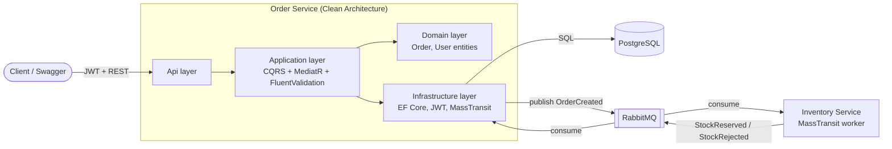

# OrderFlow 🍎

A small but complete **event-driven microservices system** built with .NET 8 — created as a hands-on portfolio project to demonstrate Clean Architecture, CQRS, async messaging, testing, and containerization.

**The flow in one sentence:** a user registers, logs in, and places an order via a REST API; the order is saved as `Pending` and an event is published; a separate Inventory service consumes it, reserves stock, and answers with an event that flips the order to `Confirmed` or `Rejected`.

## Architecture



## Run it (3 commands)

```bash
git clone <this-repo> && cd OrderFlow
docker compose up --build
# then open:
open http://localhost:5001/swagger
```

That's it — migrations apply automatically on startup.

**Web UI:** http://localhost:5003 — register/login, place orders with one-click presets (happy path, insufficient stock, poison message, mangled token), watch order status and live stock update in the browser. No curl or Swagger needed.

**Or try the full flow in Swagger:**
1. `POST /api/v1/auth/register` → copy the `token`
2. Click **Authorize**, paste the token
3. `POST /api/v1/orders` with `productId: "APPLE-1"`, quantity 3
4. `GET /api/v1/orders/{id}` → watch status go `Pending` → `Confirmed`
5. Peek at stock dropping: http://localhost:5002/stock
6. RabbitMQ UI: http://localhost:15672 (guest / guest)

**Break it on purpose (the fun part) — via the web UI presets or manually:**
- Order `MANGO-1` with quantity 5 → order becomes `Rejected` (only 3 in stock)
- Order `DURIAN-1` → the Inventory consumer throws, retries 3× (watch its logs), then the message lands in the `inventory-order-created_error` queue — RabbitMQ's equivalent of a dead-letter queue
- Send a request with a mangled token → `401` before any handler runs

## Run the tests

```bash
dotnet test
```

- **Unit tests** (`tests/OrderService.UnitTests`) — handlers in isolation, EF InMemory + NSubstitute mocks, milliseconds each
- **Integration tests** (`tests/OrderService.IntegrationTests`) — the real app booted in memory via `WebApplicationFactory`, real HTTP, real JWT validation, SQLite instead of Postgres, MassTransit test harness instead of RabbitMQ. No Docker needed.

## Tech decisions

| Decision | Why | Trade-off accepted |
|---|---|---|
| Clean Architecture (4 layers) | Business logic testable without HTTP/DB; dependencies point inward only | More projects/ceremony than a small CRUD app strictly needs |
| CQRS with MediatR | One handler = one use case = one focused unit test; validation as a pipeline behavior applies to every command automatically | Indirection: request flow is less obvious than a direct service call |
| RabbitMQ + MassTransit | Free, runs locally in Docker; MassTransit's abstractions (retry, error queues) map 1:1 to Azure Service Bus concepts | No broker-native dead-lettering — MassTransit emulates it with `_error` queues |
| PostgreSQL + EF Core migrations | Real relational DB, schema versioned in code, `Migrate()` on startup for zero-friction demo | Startup migration is wrong for multi-replica prod (race conditions) |
| JWT (symmetric HS256) | Stateless auth, easy to demo, standard claims flow | Single shared key; prod at scale would use asymmetric keys / an identity provider |
| PBKDF2 password hashing | Built into .NET, no dependency, salted + 100k iterations | Argon2/bcrypt are stronger choices if adding a package is acceptable |
| Global exception middleware → RFC 7807 | One error contract for all endpoints; no leaked stack traces | — |
| In-memory stock store (Inventory) | Keeps the demo focused on messaging patterns | Stock resets on restart; a real service owns its own DB |

## Project layout

```
src/
  BuildingBlocks/OrderFlow.Contracts/   # shared event records (the ONLY shared code)
  OrderService/
    OrderService.Domain/          # entities, zero dependencies
    OrderService.Application/     # CQRS handlers, validators, interfaces
    OrderService.Infrastructure/  # EF Core, migrations, JWT, MassTransit
    OrderService.Api/             # controllers, middleware, Program.cs
  InventoryService/
    InventoryService.Worker/      # MassTransit consumer + in-memory stock
web/                              # static HTML/CSS/JS UI, served by nginx
tests/
  OrderService.UnitTests/
  OrderService.IntegrationTests/
```

## What I would improve next

Honest scope: this is a learning/portfolio project, so these were deliberately left out —

1. **Transactional Outbox** — today "save order" and "publish event" are two separate operations; a crash in between loses the event. The outbox pattern writes the event to the DB in the same transaction and relays it afterwards.
2. **Persistent inventory** — give Inventory its own database instead of in-memory stock.
3. **Idempotent consumers** — track processed message IDs so duplicate deliveries can never double-reserve stock.
4. **API gateway + rate limiting** — a single entry point (e.g. YARP) in front of the services.
5. **Observability** — OpenTelemetry traces so one order can be followed across both services and the broker.
6. **CI pipeline** — GitHub Actions running `dotnet test` + `docker compose build` on every push.

See `INTERVIEW_DEFENSE.md` for how I'd talk about every decision in an interview.
